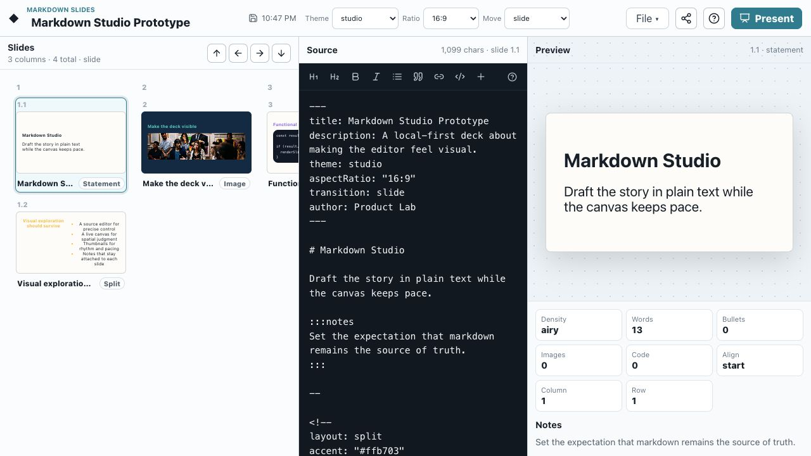

# Markdown Slides

A local-first, markdown-driven slide studio built with React and TypeScript.

Markdown Slides is a prototype for making decks the way you would make a small
web project: the markdown source stays visible, the rendered deck updates as
you write, and the whole thing can be hosted as static files on GitHub Pages.



## What It Offers

- Markdown as the source of truth for every slide.
- Live deck rendering while editing.
- A scrolling full-deck preview so slide rhythm is visible at a glance.
- Slide thumbnails for quick navigation.
- Speaker notes kept beside the selected slide.
- Lightweight slide stats for density, words, and bullets.
- Frontmatter-driven deck metadata.
- Per-slide directives for layout, background, accent, alignment, and IDs.
- Drag-and-drop image embedding directly into the markdown editor.
- Presentation mode with keyboard navigation.
- First-run guided walkthrough, with replay from the toolbar.
- LocalStorage persistence with no backend.
- Static build output that works on GitHub Pages.
- Unit tests for the functional core and Playwright tests for real user flows.

Live site:

https://notactuallytreyanastasio.github.io/gpt_slides/

## Product Shape

The app has three main work areas:

- **Source**: the markdown editor. This is the canonical deck file.
- **Canvas**: a scrollable rendered flow of the full deck.
- **Slides**: thumbnails plus the selected slide inspector and speaker notes.

The goal is to preserve the visual, exploratory feeling of building slides
while keeping the deck easy to edit, diff, export, and host.

## Markdown Format

A deck starts with YAML frontmatter:

```md
---
title: Launch Review
description: Notes for the weekly product review
theme: studio
aspectRatio: "16:9"
author: Product Lab
---
```

Slides are separated with `---`:

```md
# Opening Slide

Draft the story in plain text while the canvas keeps pace.

---

## Second Slide

- Write in markdown
- Preview the whole deck
- Present when ready
```

Speaker notes use notes blocks:

```md
:::notes
Open with the user problem before showing the solution.
:::
```

Per-slide directives can be added as a leading HTML comment with YAML:

```md
<!--
layout: split
accent: "#ffb703"
align: center
-->

## Visual exploration should survive

- Source editor
- Live canvas
- Deck outline
```

Supported directive fields:

- `id`
- `title`
- `layout`: `auto`, `title`, `statement`, `bullets`, `split`, `image`, `code`
- `background`
- `accent`
- `align`: `start`, `center`, `end`

## Image Embeds

Drag image files onto the markdown editor to insert self-contained markdown
image embeds:

```md

```

This is intentionally simple for the prototype: dropped images are stored as
data URLs inside the markdown, which keeps local editing, export, and GitHub
Pages hosting backend-free.

## Architecture

The project follows a functional core / imperative shell split.

The **functional core** lives in `src/core`:

- typed deck contracts
- frontmatter validation
- slide splitting
- slide directive parsing
- speaker note extraction
- layout inference
- slide density stats
- typed parse issues

The **imperative shell** lives around it:

- React UI
- LocalStorage persistence
- file download
- drag-and-drop image handling
- browser presentation mode
- guided walkthrough state

The core parser has no React, DOM, storage, or network concerns. The UI consumes
the parsed `Deck` model and handles browser behavior separately.

## Codex Skill

This repo includes a packaged Codex skill for generating decks in this app's
markdown format:

```txt
skills/create-markdown-slides/
```

The skill is also installed locally at:

```txt
~/.codex/skills/create-markdown-slides/
```

Use it in a chat with:

```txt
Use $create-markdown-slides to turn this brief into a polished markdown slide deck.
```

The skill contains:

- `SKILL.md`: the deck-generation workflow and quality rules.
- `references/markdown-slides-format.md`: the supported markdown/frontmatter/directive format.
- `scripts/validate_deck.py`: a lightweight validator for generated `.md` decks.

## Testing Strategy

The prototype uses two layers of tests:

- **Vitest** for pure parser and shell utility behavior.
- **Playwright** for real app flows in a browser.

Current browser flows cover:

- first-visit walkthrough
- markdown editing and live preview updates
- LocalStorage persistence through reload
- typed parse feedback for invalid metadata
- image drag/drop into the editor
- presentation mode and keyboard navigation

Run everything with:

```sh
npm run validate
```

## Scripts

```sh
npm run dev
```

Start the local Vite app.

```sh
npm run build
```

Typecheck and create the static production build in `dist/`.

```sh
npm run test
```

Run unit tests.

```sh
npm run test:e2e
```

Run Playwright browser-flow tests.

```sh
npm run validate
```

Run typecheck, unit tests, and Playwright tests.

## GitHub Pages

The app is built for static hosting. The Vite config uses relative asset paths,
and the app persists browser-local data in LocalStorage.

The repository includes a GitHub Pages workflow:

```txt
.github/workflows/pages.yml
```

On pushes to `main`, GitHub Actions installs dependencies, builds the static
site, uploads `dist/`, and deploys it through GitHub Pages.

Repository Pages should be configured with:

- Source: GitHub Actions
- URL: `https://notactuallytreyanastasio.github.io/gpt_slides/`

## Current Status

This is an early prototype, but the core loop is working:

1. Write markdown.
2. See the full deck render immediately.
3. Drag images into the editor.
4. Move through thumbnails and notes.
5. Present the deck.
6. Deploy the static app to GitHub Pages.

Next useful directions would be theme authoring, HTML/PDF export, richer layout
directives, deck import/export polish, and eventually collaboration.
